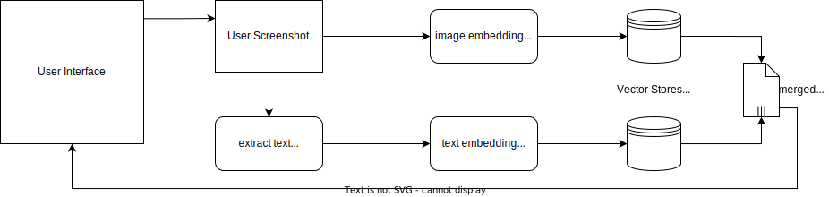

# Multi Modal Document Search

As a rather quick project, this repository provides a streamlit application that enables a user to upload a screenshot which will than be queried against a database of PDF documents. Both the image structure as well as the (possibly) included text are used to find matching documents for a self defined set.

## Query Process

When a user uploads a screenshot, two flows are triggered. First we build an image embedding form two chunks of the screenshot. The chunks are constructed since the [ViT-G-14](https://huggingface.co/laion/CLIP-ViT-g-14-laion2B-s12B-b42K) image embedding is trained on square inputs. Power-Point slides or A4 documents are usually have a side relation of closer to 2:1, thats why chunking should support the overall query quality. The image embeddings (2 x 1024dim) are then queried against a vector store of known chunks. The second flow first extracts text from the screenshot using [Google's Tesseract OCR engine](https://github.com/tesseract-ocr/tesseract). Afterwards the text embeddings (1024dim) are build using one of the best performing multi-language models, [e5-large](https://huggingface.co/intfloat/multilingual-e5-large). In a final step the results are merged back together, using a shared id system between the vector stores, and send to the user.

## Design Decisions
This is the place where I share some of my thoughts.
### Why use Screenshots and not Documents as Input?
The Idea was to provide a quick to use tool. Assume you have a presentation slide and would like to know if you created something similar previously. If you would upload the whole document, there would be a requirement for an extra page number input field, you would need to find the document in your file system and the files type would need to be supported. Just taking a screenshot is quicker( there are handy shortcuts on all OS) and just uploading a single picture is straight forward.
### Why streamlit?
It is fast to put together a small app and I like visual interfaces way more than CLI based tools.
### How where the models picked?
Mostly through huggingface leaderboards. Since this is a small project I also wanted to exclusively use pre-trained models.
### How get your own documents into the vector stores?
The script `pdf_to_db.py` is a simple iteration over all documents in `pdfs/` which uses the other classes to fill the vector stores. 

## Conclusion
This is not an actively developed project and was mostly used to do a hands on project with the used technologies. If you have any questions, feel free to contact me.